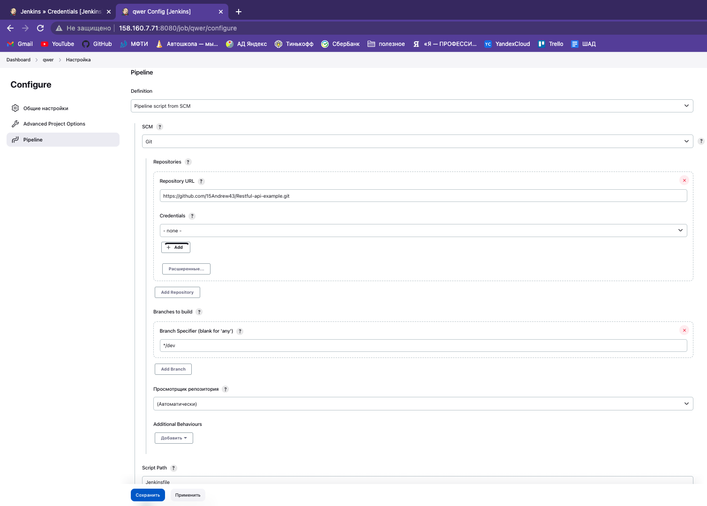

## В stage Build:
 - собираем image из докерфайла и файлов из гитхаба
 - запускаем контейнер

## В stage Test:
 - запускаем тесты внутри контейнера

## В stage Deploy:
 - логинемся в докерхаб
 - пушим в регистри полученый image
 - запускаем playbook из гитхаба (раскатываем протестированное приложение на сервера)